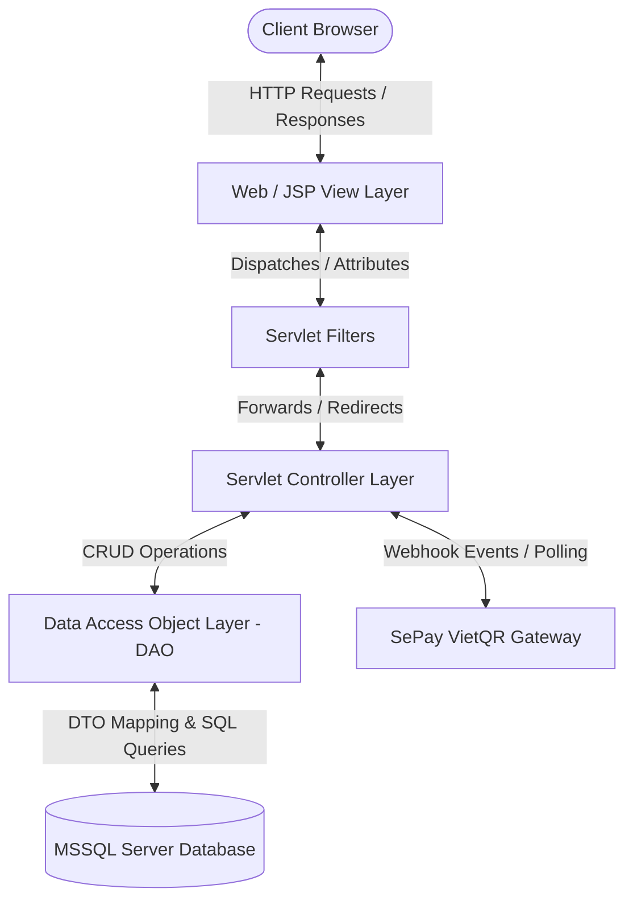
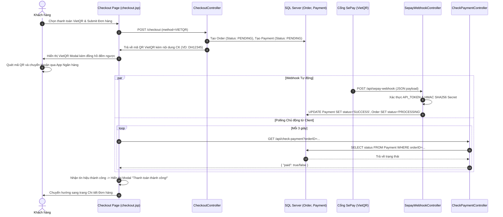

# ARCHITECTURE.md — ONE61 Garmentory System Architecture

This document details the architectural design, layered structure, data flow, security pipelines, and third-party integrations of the **ONE61 Garmentory** application.

---

## 1. Architectural Pattern: Classic MVC Layering



### Layer Responsibilities

1. **View Layer (`web/*.jsp`, `web/includes/*.jsp`, `web/admin/*.jsp`)**:
   - Renders HTML/CSS/JS using JSTL core (`c:forEach`, `c:if`, `c:choose`) and formatting (`fmt:formatNumber`).
   - Pure presentation; contains zero raw business logic or SQL queries.
2. **Filter Pipeline (`src/java/filter/`)**:
   - Intercepts requests before reaching Servlets.
   - `EncodingFilter`: Ensures UTF-8 throughout request/response lifecycle.
   - `AuthenticationFilter`: Ensures valid session for protected endpoints.
   - `AuthorizationFilter`: Verifies user role (Admin vs Customer).
3. **Controller Layer (`src/java/controller/`)**:
   - Extends `HttpServlet`.
   - Parses HTTP parameters, performs validation, interacts with DAO models, and forwards to Views.
4. **Model Layer (`src/java/model/`)**:
   - **DTO (Data Transfer Objects)**: POJOs representing database entity states.
   - **DAO (Data Access Objects)**: Encapsulates all SQL execution using `java.sql.PreparedStatement` with try-with-resources.
5. **Utility Layer (`src/java/utils/`)**:
   - Stateless helper singletons for connection pooling, password cryptography, environment variables, and CSRF protection.

---

## 2. VietQR & SePay Webhook Payment Architecture

The system supports automated bank transfer reconciliation via **SePay VietQR Webhooks**:



---

## 3. Recursive Product Architecture

Unlike standard flat catalogs, ONE61 Garmentory models products as a **self-referencing tree**:

```
Product (Parent: PROD01 - Áo Sơ Mi Oxford Nam)
 ├── image: "products/men/cover/cover-shirts-men-1.avif"  [isPrimary / Catalog View]
 ├── Child: PROD01_01 -> "products/men/content/content-shirts-men-1-01.avif" (Mặt trước)
 ├── Child: PROD01_02 -> "products/men/content/content-shirts-men-1-02.avif" (Phối đồ)
 ├── Child: PROD01_03 -> "products/men/content/content-shirts-men-1-03.avif" (Chi tiết vải)
 └── Child: PROD01_04 -> "products/men/content/content-shirts-men-1-04.avif" (Form dáng)
```

- **Database Constraint:** `parentID VARCHAR(50) FOREIGN KEY REFERENCES [Product](productID) NULL`
- **Dynamic Lookbook Resolution:**
  1. In `ProductController`: calls `pDao.getChildProducts(productID)`.
  2. In `product-detail.jsp`: iterates over `${CHILD_PRODUCTS}`. It dynamically adapts to 3, 4, or any variable image count without hardcoded layout bugs.

---

## 4. Security & Cryptography Framework

| Security Vector | Implementation Detail | Target Files |
| :--- | :--- | :--- |
| **Password Storage** | SHA-256 Hashing with Hex conversion (Never plain-text) | `PasswordUtils.java`, `UserDAO.java` |
| **SQL Injection** | Parameterized queries via `PreparedStatement` on all DAOs | `ProductDAO.java`, `OrderDAO.java`, `UserDAO.java` |
| **CSRF Defense** | Cryptographic token generated per session and validated on POST forms | `CSRFUtils.java` |
| **URL Tampering** | Role-based verification in `AuthenticationFilter` & `AuthorizationFilter` | `src/java/filter/*` |
| **XSS & Encoding** | Global UTF-8 encoding filter + JSTL escaping `<c:out>` / standard bindings | `EncodingFilter.java` |
