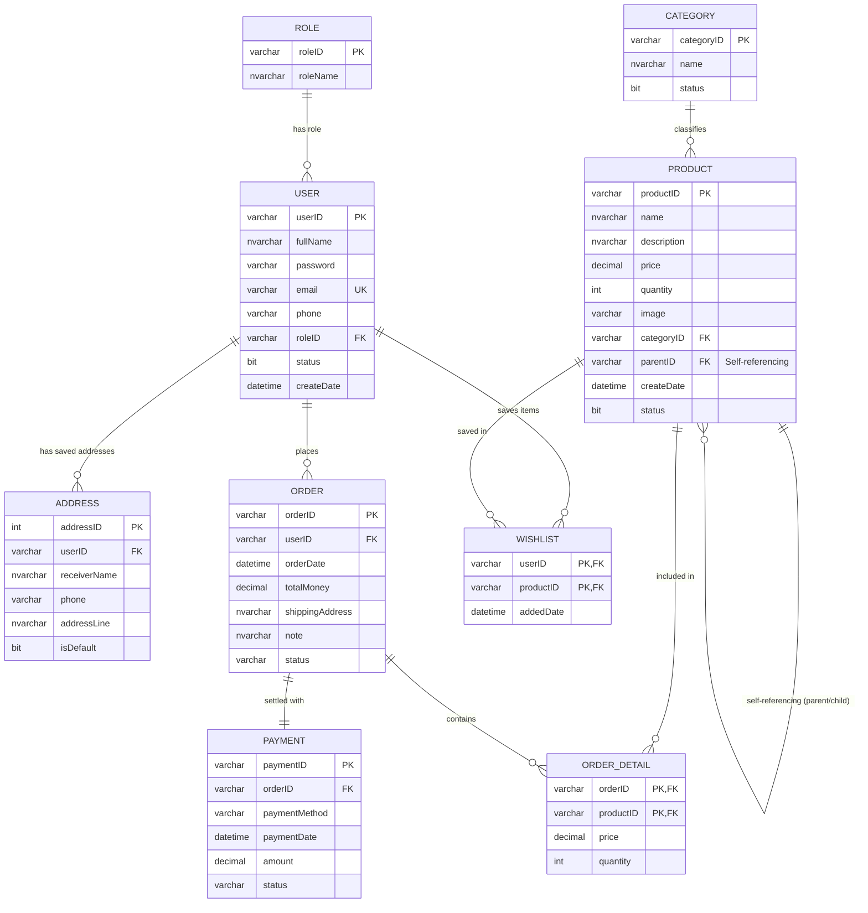

# DATABASE.md — ONE61 Garmentory Database Documentation

This document outlines the entity-relationship schema, table definitions, constraints, indexes, sample queries, and deployment guidelines for the **ONE61 Garmentory** database (`PRJ301_Ecommerce`).

---

## 1. Entity-Relationship (ER) Diagram



---

## 2. Table Specifications

### 2.1 `[Role]`
| Column | Type | Constraints | Description |
| :--- | :--- | :--- | :--- |
| `roleID` | `VARCHAR(20)` | `PRIMARY KEY` | Role code (`ADMIN`, `CUS`) |
| `roleName` | `NVARCHAR(50)` | `NOT NULL` | Role display name |

### 2.2 `[User]`
| Column | Type | Constraints | Description |
| :--- | :--- | :--- | :--- |
| `userID` | `VARCHAR(50)` | `PRIMARY KEY` | Unique username / login identifier |
| `fullName` | `NVARCHAR(100)` | `NOT NULL` | User's full name |
| `password` | `VARCHAR(255)` | `NOT NULL` | SHA-256 cryptographic password hash |
| `email` | `VARCHAR(100)` | `NOT NULL UNIQUE` | Unique email address |
| `phone` | `VARCHAR(15)` | `NULL` | Phone number |
| `roleID` | `VARCHAR(20)` | `FK -> Role(roleID)` | Role assignment |
| `status` | `BIT` | `DEFAULT 1` | Active (1) or Inactive (0) |
| `createDate`| `DATETIME` | `DEFAULT GETDATE()`| Registration timestamp |

### 2.3 `[Category]`
| Column | Type | Constraints | Description |
| :--- | :--- | :--- | :--- |
| `categoryID` | `VARCHAR(20)` | `PRIMARY KEY` | Category code (e.g. `MEN_01`, `WOMEN_01`) |
| `name` | `NVARCHAR(100)` | `NOT NULL` | Category title |
| `status` | `BIT` | `DEFAULT 1` | Active (1) or Disabled (0) |

### 2.4 `[Product]` (Self-Referencing / Recursive)
| Column | Type | Constraints | Description |
| :--- | :--- | :--- | :--- |
| `productID` | `VARCHAR(50)` | `PRIMARY KEY` | Unique product identifier (e.g. `PROD01`, `PROD01_01`) |
| `name` | `NVARCHAR(255)` | `NOT NULL` | Product name |
| `description` | `NVARCHAR(MAX)` | `NULL` | Full product specification |
| `price` | `DECIMAL(18,2)` | `NOT NULL` | Unit price in VND |
| `quantity` | `INT` | `DEFAULT 0` | Stock inventory level |
| `image` | `VARCHAR(255)` | `NULL` | Relative image asset path |
| `categoryID` | `VARCHAR(20)` | `FK -> Category(categoryID)` | Primary category |
| `parentID` | `VARCHAR(50)` | `FK -> Product(productID) NULL`| **Recursive parent pointer** (`NULL` for cover products) |
| `createDate` | `DATETIME` | `DEFAULT GETDATE()` | Creation timestamp |
| `status` | `BIT` | `DEFAULT 1` | Available (1) or Soft-deleted (0) |

### 2.5 `[Order]` & `[OrderDetail]`
- **`Order`**: Tracks order code (`orderID`), client (`userID`), total amount (`totalMoney`), delivery address, and status (`PENDING`, `PROCESSING`, `SHIPPED`, `DELIVERED`, `CANCELLED`).
- **`OrderDetail`**: Composite key `(orderID, productID)` tracking unit purchase price and quantity.

### 2.6 `[Payment]`
- Tracks payment transaction ID (`paymentID`), linked `orderID`, method (`COD`, `VIETQR`, `VNPAY`), timestamp, amount, and payment status (`PENDING`, `SUCCESS`, `FAILED`).

---

## 3. Useful Queries

### 3.1 Fetch Catalog Products with Pagination (Master Only)
```sql
SELECT * FROM [Product]
WHERE parentID IS NULL AND status = 1
ORDER BY productID
OFFSET 0 ROWS FETCH NEXT 10 ROWS ONLY;
```

### 3.2 Fetch All Content Angles for Product Detail
```sql
SELECT * FROM [Product]
WHERE parentID = 'PROD01' AND status = 1
ORDER BY productID ASC;
```

### 3.3 Verify Master-Child Relationships
```sql
SELECT 
    p.productID AS ParentCode,
    p.name AS MasterName,
    p.image AS CoverImage,
    c.productID AS ChildCode,
    c.image AS ContentAngleImage
FROM [Product] p
LEFT JOIN [Product] c ON p.productID = c.parentID
WHERE p.parentID IS NULL
ORDER BY p.productID, c.productID;
```

---

## 4. Deployment Guides

### Local SQL Server:
1. Open SQL Server Management Studio (SSMS).
2. Open [`PRJ301_Ecommerce.sql`](./PRJ301_Ecommerce.sql).
3. Execute with **F5**.

### Remote Somee Hosting:
1. Log in to [Somee.com](https://somee.com) $\rightarrow$ User Area $\rightarrow$ MS SQL $\rightarrow$ Your Database.
2. Go to **Manage SQL** / **Run SQL Script**.
3. Open [`PRJ301_Ecommerce_Somee.sql`](./PRJ301_Ecommerce_Somee.sql), copy all content and click **Run SQL**.
